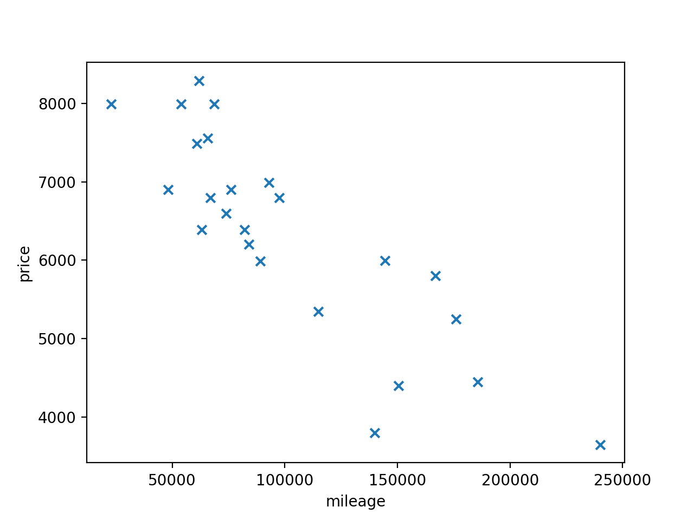
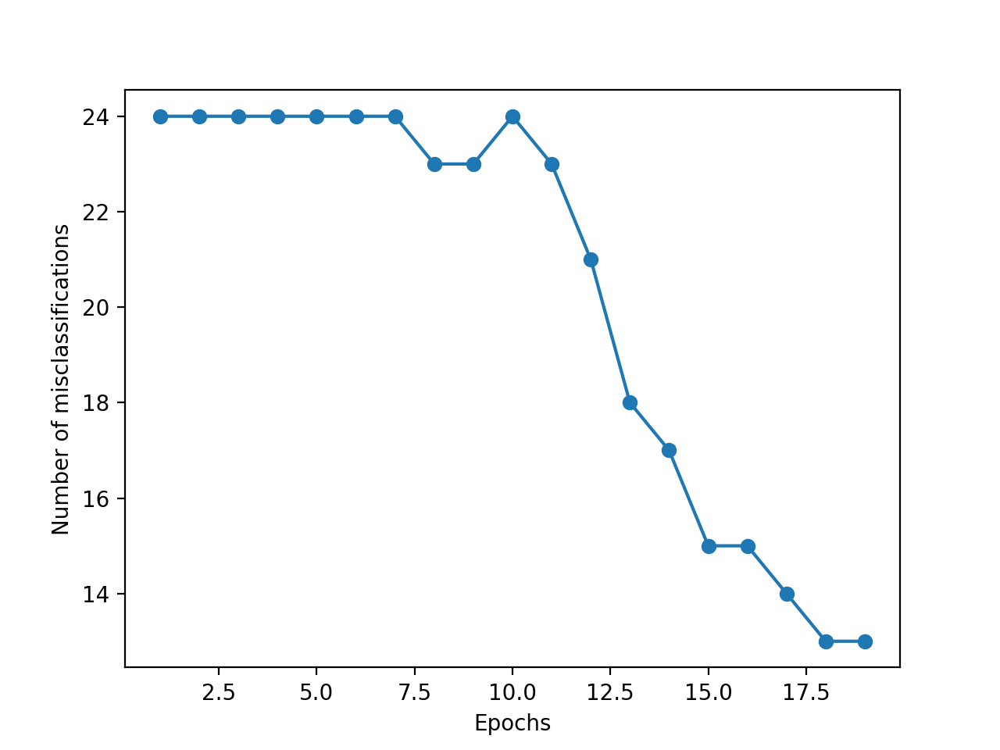
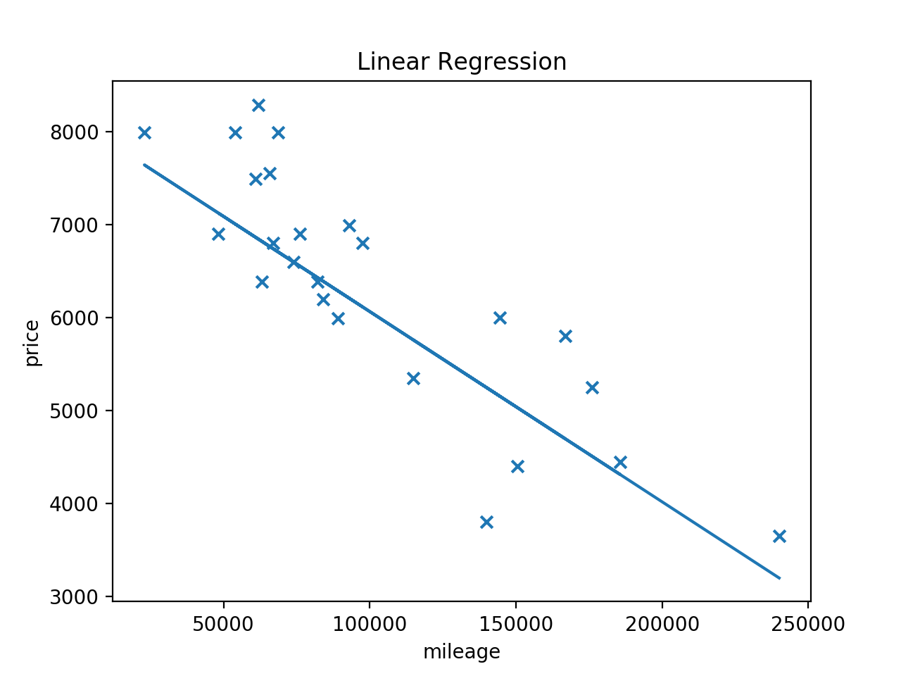

# Linear_Regression

About
-----
> This project will be our first steps into AI and Machine Learning. We're going to start with a simple, basic machine learning algorithm.
>
>We will have to create a program that predicts the price of a car by using a linear function train with a gradient descent algorithm.

This is the first project of the Artificial Intelligence branch at School 42 Paris

Math
----
$h_\theta(x)=\theta_0+\theta_1x$

$J(\theta_0, \theta_1)=\frac{1}{2m}\sum_{i=1}^{m}(h_\theta(x^{(i)}) - y^{(i)})^2$

$\theta_j=\theta_j-\alpha\frac{\partial}{\partial\theta_j}J(\theta_0, \theta_1)$

$\frac{\partial}{\partial\theta_j}J(\theta_0, \theta_1)=\frac{1}{m}\sum_{i=1}^{m}(h_\theta(x^{(i)}) - y^{(i)})\cdot{x^{(i)}}$

Installation
------------
Run `make install`

Usage
-----
`python3 gradient_descent.py [-h] [-v] dataset`
* -h: Show help message and exit
* -v: Show model

`python3 linear_function.py [-h] mileage`
* -h: Show help message and exit

### Example

First we need to train our model with the provided dataset

`python3 gradient_descent.py -v datasets/data.csv`

<div align="center">
  
  
  
</div>

This will save the weights trained in `./linear_regression/model.csv`
```
> cat linear_regression/model.csv
6043.105226385924,-1055.5859845721293,101066.25,51565.1899106445
```

Then, to make a prediction
```
> python3 linear_function.py 75000
Estimated Price: 6576.704893487574
```

##### Project done in 2018
